# DSA210 Term Project  
## Human-to-AI Interaction Shift Analysis

<p align="center">
  <a href="https://berenied-dsa210-human-ai-shift.lovable.app" target="_blank">
    
  </a>
</p>

<p align="center">
  <strong>A visual data story of the human-to-AI help-seeking shift</strong><br>
  Google Trends · Platform Traffic · Survey Evidence · Hypothesis Testing · Machine Learning
</p>

---

**Course:** DSA 210 – Introduction to Data Science  
**Student:** Ela Beren Yücel  
**Student ID:** 34155  

---

## Project Overview

In recent years, AI tools such as ChatGPT have become a common way for people to ask questions, get explanations, receive advice, and study. Before these tools became widely used, people often relied on human-based or traditional online platforms such as Quora, Yahoo Answers, Ask.fm, Chegg, and Course Hero.

This project investigates whether there is evidence that some online help-seeking behavior is shifting toward AI-based alternatives.

The project does **not** claim that traditional platforms disappeared. It also does **not** claim that every user directly moved from one platform to another. Instead, it asks whether search behavior and supporting data show that AI-based tools are becoming more visible and important in similar contexts.

---

## Research Question

**To what extent are people shifting from traditional human-based help-seeking platforms toward AI-based alternatives?**

To make this question measurable, the project focuses on three types of online behavior:

| Area | Explanation |
|---|---|
| Advice and interaction | People looking for advice, conversation, or social-style support |
| General help-seeking | People searching for answers, explanations, or practical help |
| Study support | Students looking for homework help, explanations, or learning resources |

---

## Main Idea

The main idea is simple:

People used to search for help through traditional platforms.  
Now, some of that attention may be moving toward AI-related tools.

This project tests that idea using multiple types of evidence:

```text
Google Trends search behavior
        +
Platform traffic context
        +
Survey evidence
        +
Machine learning models
        =
A broader view of the human-to-AI interaction shift
```

---

## Key Findings

The overall results suggest that AI-related help-seeking behavior is becoming more visible and measurable.

| Evidence | What It Shows |
|---|---|
| Google Trends | AI-related search terms follow different patterns from traditional platform terms |
| Hypothesis testing | The differences between AI-related and traditional search patterns are statistically significant |
| Platform traffic | Some AI platforms gained traffic, while several traditional study-support platforms declined |
| Stack Overflow survey | AI tool usage among respondents increased from 44.38% in 2023 to 78.50% in 2025 |
| Pew AI survey | AI awareness is high, but public attitudes are still mixed and cautious |
| Machine learning classification | AI-related and non-AI observations can be distinguished from trend patterns |
| Machine learning regression | Google Trends search interest can be predicted using non-linear models |

The results support a **shift in attention and search behavior**, but not a complete replacement of traditional platforms.

---

## Data Sources

The main dataset is **Google Trends**, because it directly shows how search interest changes over time.

The project also uses supporting datasets to make the analysis stronger.

| Dataset | Why It Was Used |
|---|---|
| Google Trends | To measure search interest for AI-related and traditional platform terms |
| Platform traffic data | To compare recent traffic change across platform types |
| Stack Overflow survey data | To check whether AI tool usage increased among survey respondents |
| Pew AI survey data | To understand public awareness and attitudes toward AI |

---

## Keywords Used in Google Trends

The Google Trends analysis compares AI-related search terms with traditional platform terms in the same general context.

| Context | Traditional / Non-AI Terms | AI-Related Terms |
|---|---|---|
| Advice and interaction | `Yahoo Answers`, `Ask.fm` | `ai friend` |
| General help-seeking | `quora` | `chatgpt help` |
| Study support | `course hero`, `chegg` | `chatgpt study` |

These terms were selected because they represent different ways people look for help online. For example, Quora represents human-based question answering, while `chatgpt help` represents AI-based help-seeking.

---

## Repository Structure

```text
dsa210-term-project/
│
├── data/
│   ├── raw/                 # original Google Trends, Pew, and Stack Overflow files
│   └── processed/           # cleaned datasets used in analysis
│
├── figures/                 # visualizations used in this README
├── notebooks/               # data preparation, EDA, hypothesis testing, and ML notebooks
├── report/                  # phase reports
│
├── DSA210 - Project Proposal.pdf
├── README.md
└── requirements.txt
```

---

## Data Preparation

Before analysis, the raw files were cleaned and converted into processed datasets.

### Google Trends Data

The Google Trends files were cleaned first because they are the main evidence for the project.

| Preparation Step | Explanation |
|---|---|
| Date cleaning | Dates were converted into datetime format |
| Keyword cleaning | Keyword names were standardized across files |
| Numeric conversion | Search interest scores were converted into numeric values |
| Low-value handling | Values such as `<1` were treated as `0.5` |
| Data reshaping | The data was converted into a clean long-format dataset |
| Platform labeling | Each keyword was labeled as AI platform, forum/Q&A platform, or study-support platform |

After cleaning, the Google Trends dataset could be used for visualizations, comparison metrics, hypothesis tests, and machine learning.

---

### Platform Traffic Data

The platform traffic data was used to give recent context about platform activity.

The dataset included platforms such as ChatGPT, Claude, Character AI, Quora, WikiHow, Chegg, Course Hero, Khan Academy, and Quizlet. These platforms were grouped into broader categories such as AI platforms, Q&A platforms, general help platforms, and study-support platforms.

The traffic values were cleaned and converted into numeric form. Then, the dataset was used to compare how each platform changed from its first observed month to its last observed month. This is more useful than only looking at average visits because it shows whether each platform gained or lost traffic over time.

This dataset is only supporting evidence because it covers a short time period.

---

### Stack Overflow Survey Data

The Stack Overflow survey data was used to check whether AI tool adoption increased over time.

AI-related survey responses were grouped into broader categories such as:

- uses AI
- plans to use AI
- does not plan to use AI

Then, the results were summarized by year for 2023, 2024, and 2025.

---

### Pew AI Survey Data

The Pew AI survey data was used to understand broader public awareness and attitudes toward AI.

Two types of information were summarized:

- whether respondents had heard about AI
- whether respondents felt more concerned or more excited about AI

This helped show that AI is widely visible, but public opinion is not purely positive.

---

## Analysis Roadmap

The project follows a layered analysis structure.

```text
1. Clean the raw datasets
2. Visualize Google Trends search patterns
3. Compare AI-related and traditional platform trends
4. Run hypothesis tests
5. Add traffic and survey context
6. Train machine learning models
7. Interpret whether the evidence supports a shift toward AI-based help-seeking
```

---

## Google Trends Analysis

Google Trends is the main evidence because it shows how public search interest changed over time.

The following plots compare AI-related terms with traditional platform terms.

---

### 1. Advice and Interaction

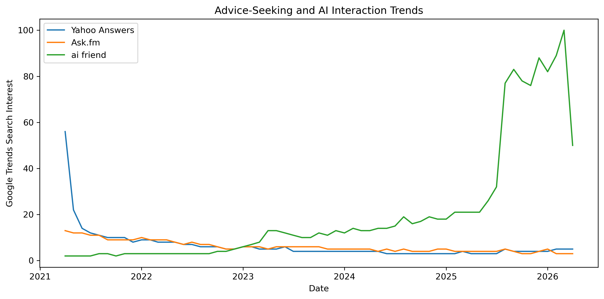

This plot compares `ai friend` with `Yahoo Answers` and `Ask.fm`.

The AI-related term becomes much more visible in the later period. The older advice and interaction platforms remain much lower. This suggests that AI-based interaction is becoming more noticeable in online search behavior.

---

### 2. General Help-Seeking

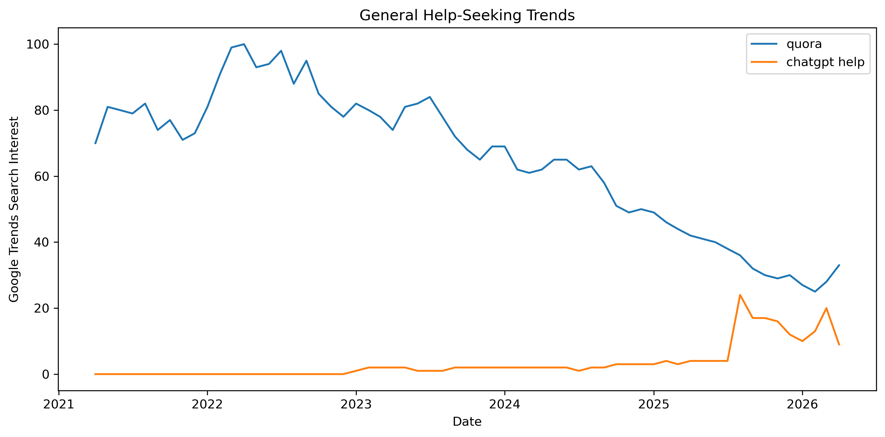

This plot compares `chatgpt help` with `quora`.

Quora still has higher overall search interest, but `chatgpt help` begins to appear more clearly in the later period. This suggests that AI-based help-seeking is developing its own search pattern rather than simply replacing Quora completely.

---

### 3. Study Support

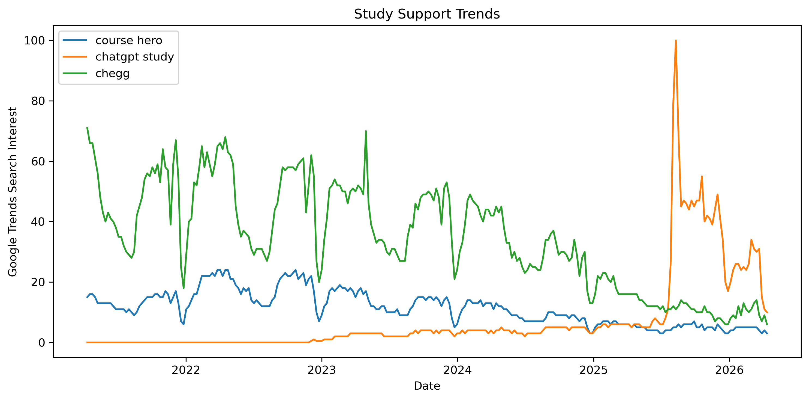

This plot compares `chatgpt study` with `chegg` and `course hero`.

The AI-related study term becomes more visible over time. Traditional study-support platforms still appear in the data, but their later patterns are weaker compared with the earlier period. This suggests that AI tools may be gaining attention in student support and learning contexts.

---

## Hypothesis Testing

To test whether the visual differences were statistically meaningful, paired t-tests were used.

A paired t-test was used because each AI-related trend value was compared with a traditional platform value from the same time period. Before interpreting the paired t-test results, the paired differences were checked with the Shapiro-Wilk normality test.

The normality checks showed that the paired differences were not normally distributed. For this reason, Wilcoxon signed-rank tests were also applied as non-parametric robustness checks.

The tests compared AI-related search interest with traditional platform search interest from the same category.

| Comparison | Paired t-test p-value | Wilcoxon p-value | Result |
|---|---:|---:|---|
| `ai friend` vs traditional advice average | 2.1694e-04 | 8.0002e-05 | Significant difference |
| `chatgpt help` vs `quora` | 8.1217e-27 | 1.1054e-11 | Significant difference |
| `chatgpt study` vs traditional study average | 6.4909e-24 | 2.1152e-20 | Significant difference |

All three paired t-tests showed statistically significant differences. The Wilcoxon signed-rank tests also showed significant differences, which supports the results even when the normality assumption is relaxed.

This means the AI-related and traditional search patterns are not just randomly different. However, this does not prove that the same individuals directly switched from one platform to another. It only shows that the overall search patterns differ in a meaningful way.

---

## Platform Traffic Context

Google Trends shows search interest, but platform traffic gives another perspective: whether selected platforms are gaining or losing recent activity.

This part does not only compare platform size. It focuses on **change over time**.

The traffic data is used as supporting evidence because it covers only a short period. Still, it helps show recent platform-level movement.

---

### Relative Traffic Change by Platform

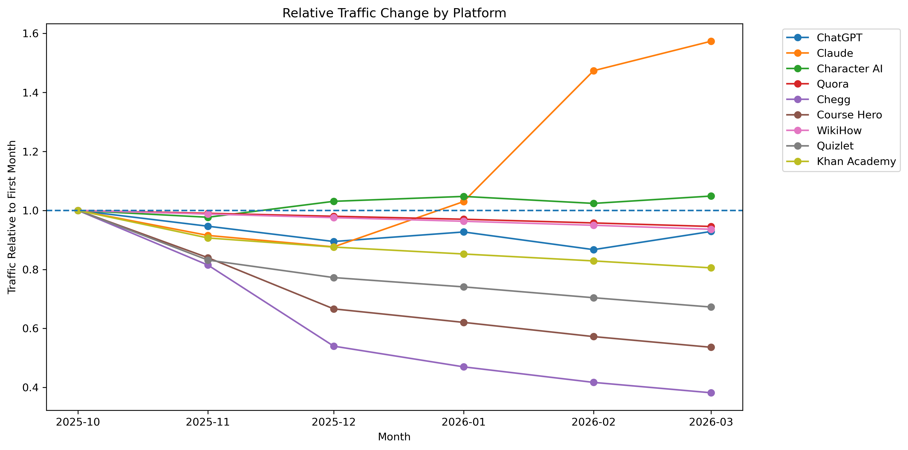

This plot shows how each platform’s traffic changed relative to its first observed month.

A value above `1` means the platform increased compared with its first month.  
A value below `1` means the platform decreased compared with its first month.

This is useful because a platform can have high total traffic but still be decreasing over time. The relative change plot shows the direction of movement more clearly.

---

### Traffic Change Summary by Platform

The table below summarizes first-to-last month traffic change for each platform.

| Platform Type | Platform | First Month | Last Month | Percentage Change | Trend Direction |
|---|---|---|---|---:|---|
| AI platform | Character AI | 2025-10-01 | 2026-03-01 | 4.88% | positive |
| AI platform | ChatGPT | 2025-10-01 | 2026-03-01 | -7.13% | negative |
| AI platform | Claude | 2025-10-01 | 2026-03-01 | 57.36% | positive |
| Forum Q&A platform | Quora | 2025-10-01 | 2026-03-01 | -5.43% | negative |
| General help platform | WikiHow | 2025-10-01 | 2026-03-01 | -6.38% | negative |
| Study support platform | Chegg | 2025-10-01 | 2026-03-01 | -61.81% | negative |
| Study support platform | Course Hero | 2025-10-01 | 2026-03-01 | -46.39% | negative |
| Study support platform | Khan Academy | 2025-10-01 | 2026-03-01 | -19.46% | negative |
| Study support platform | Quizlet | 2025-10-01 | 2026-03-01 | -32.74% | negative |

Two of the three AI platforms increased during the observed period, while all study-support platforms decreased. This does not prove long-term replacement because the traffic window is short, but it supports the idea that AI platforms are gaining recent attention while several traditional study-support platforms are losing traffic.

---

### Platform-Type Traffic Summary

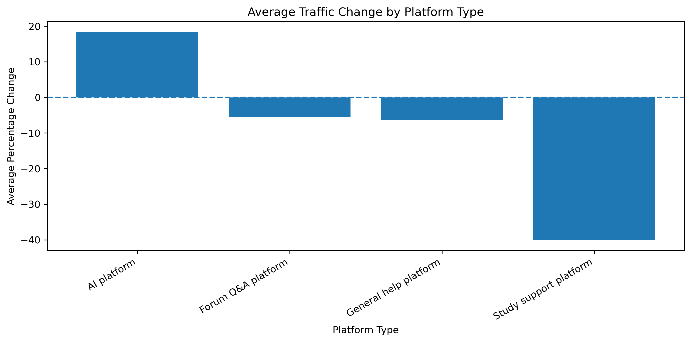

This plot summarizes the same traffic-change pattern at the platform-type level.

| Platform Type | Average Percentage Change | Positive Platforms | Negative Platforms |
|---|---:|---:|---:|
| AI platform | 18.37% | 2 | 1 |
| Forum Q&A platform | -5.43% | 0 | 1 |
| General help platform | -6.38% | 0 | 1 |
| Study support platform | -40.10% | 0 | 4 |

AI platforms show positive average traffic change, while Q&A, general help, and study-support platform groups show negative average change in this short traffic window.

Because the time window is short, this does not prove a long-term replacement. It is used as recent supporting context.

---

### Additional Traffic Scale Context

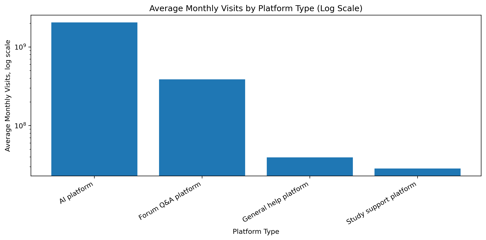

This plot adds scale context to the traffic analysis. It shows that even if ChatGPT has a negative percentage change in the short traffic window, it still has much higher total monthly visit volume than the other selected platforms.

This is why traffic change should be interpreted together with traffic scale. A small decrease for a very large platform does not mean the platform became unimportant. In this project, the traffic data is used only as recent supporting context, while Google Trends remains the main evidence for search behavior.

---

## Survey Evidence

Survey data was used to check whether AI adoption and awareness trends also appear outside Google Trends.

---

### Stack Overflow AI Adoption

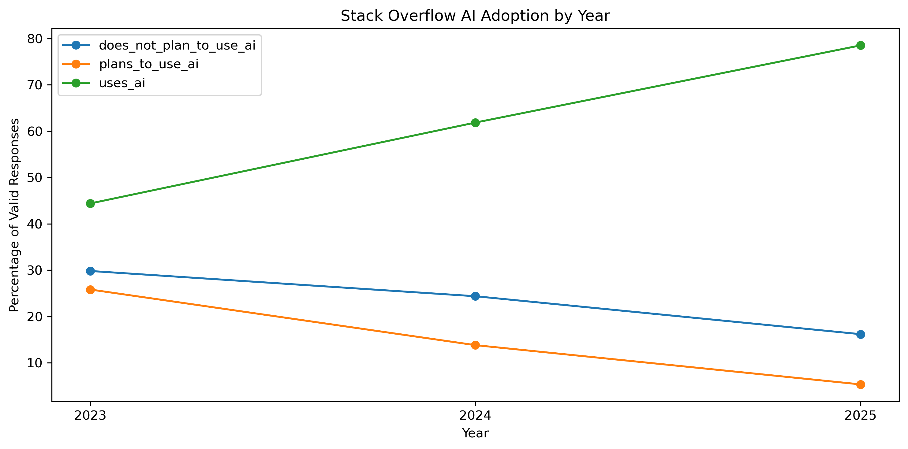

The Stack Overflow survey results show that AI tool usage increased strongly among respondents.

| Year | Does Not Plan to Use AI | Plans to Use AI | Uses AI |
|---|---:|---:|---:|
| 2023 | 29.81% | 25.81% | 44.38% |
| 2024 | 24.36% | 13.80% | 61.84% |
| 2025 | 16.17% | 5.33% | 78.50% |

This supports the idea that AI tools are becoming more common in online problem-solving and technical help contexts.

---

### Pew AI Awareness

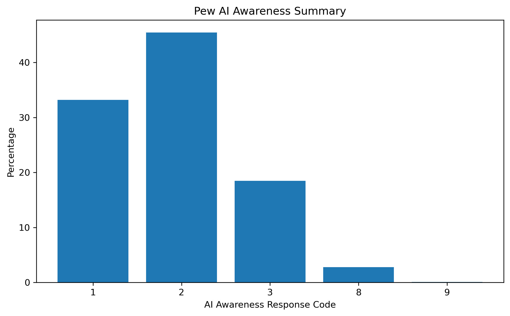

The Pew survey provides broader public context.

The awareness results show that many respondents have heard at least something about AI. This matters because AI-based tools can only become part of mainstream help-seeking behavior if people are aware of them.

---

### Pew AI Attitudes

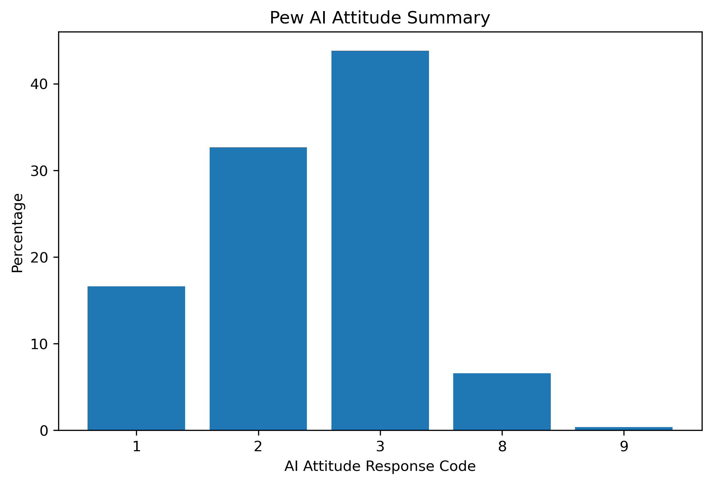

The attitude results show that public reactions to AI are mixed and cautious.

This is important because higher AI visibility does not automatically mean full trust or full acceptance. People may use or search for AI tools while still having concerns about them.

---

## Machine Learning Analysis

The machine learning part adds a predictive layer to the project.

Instead of only describing the trends, the models test whether AI-related and non-AI observations can be distinguished from the available data.

Two machine learning tasks were used:

| Task | What the Model Predicts |
|---|---|
| Classification | Whether a Google Trends observation belongs to an AI platform or non-AI platform |
| Regression | The Google Trends search interest score |

---

## Classification Models

The classification task asks:

**Can a model identify whether a search trend observation is AI-related or non-AI-related?**

The models tested were:

- baseline classifier
- Logistic Regression
- Decision Tree Classifier
- Random Forest Classifier

Two feature sets were used:

| Feature Set | Explanation |
|---|---|
| Pattern-only features | Uses trend score, time, and category, but not keyword names |
| Full features | Includes keyword names, which makes the task much easier |

The pattern-only feature set is more important for interpretation because it tests whether AI-related observations can be identified without directly giving the model the keyword name.

---

### Classification Model Comparison

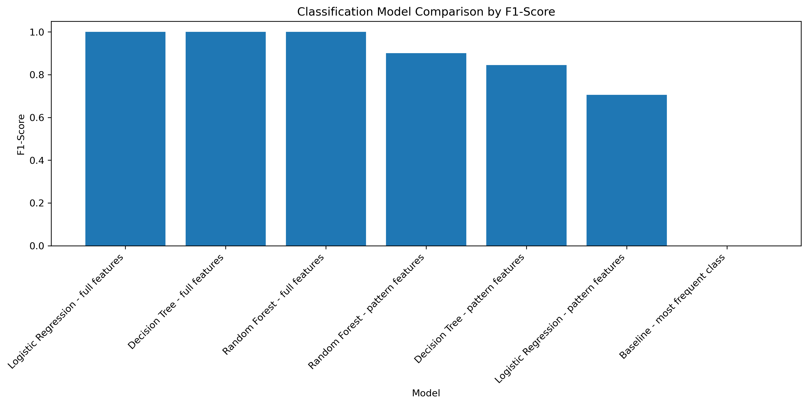

| Model | Accuracy | Precision | Recall | F1-score | ROC-AUC |
|---|---:|---:|---:|---:|---:|
| Baseline | 0.6484 | 0.0000 | 0.0000 | 0.0000 | 0.5000 |
| Logistic Regression - pattern | 0.8402 | 1.0000 | 0.5455 | 0.7059 | 0.8436 |
| Decision Tree - pattern | 0.8858 | 0.8095 | 0.8831 | 0.8447 | 0.9552 |
| Random Forest - pattern | 0.9315 | 0.9189 | 0.8831 | 0.9007 | 0.9920 |

The baseline model predicts only the majority class, so it cannot identify AI-related observations.

The Random Forest pattern-only model performs best among the meaningful models. It reaches an F1-score of **0.9007**, which shows that AI-related and non-AI observations can often be separated using trend behavior, time, and category information.

---

### Confusion Matrix

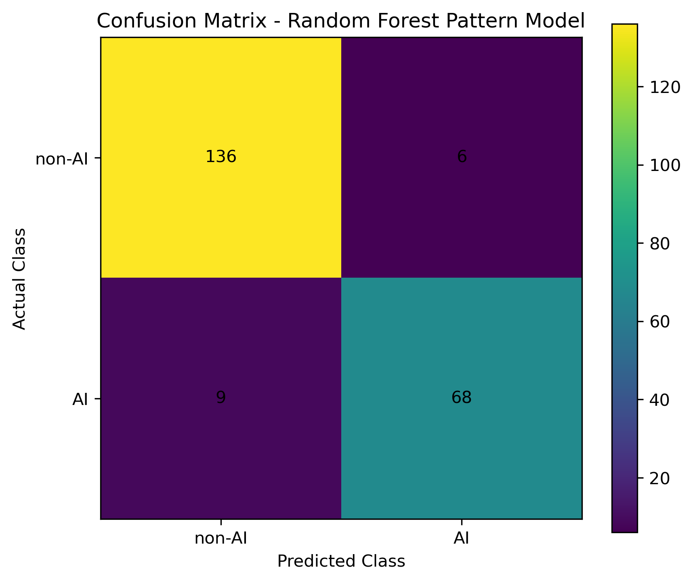

| Actual / Predicted | Predicted non-AI | Predicted AI |
|---|---:|---:|
| Actual non-AI | 136 | 6 |
| Actual AI | 9 | 68 |

The best pattern-only classifier correctly classified **204 out of 219** test observations.

Most mistakes occurred in the study-support category. This makes sense because AI-based study support and traditional study-support platforms can have overlapping search behavior.

---

### Feature Importance

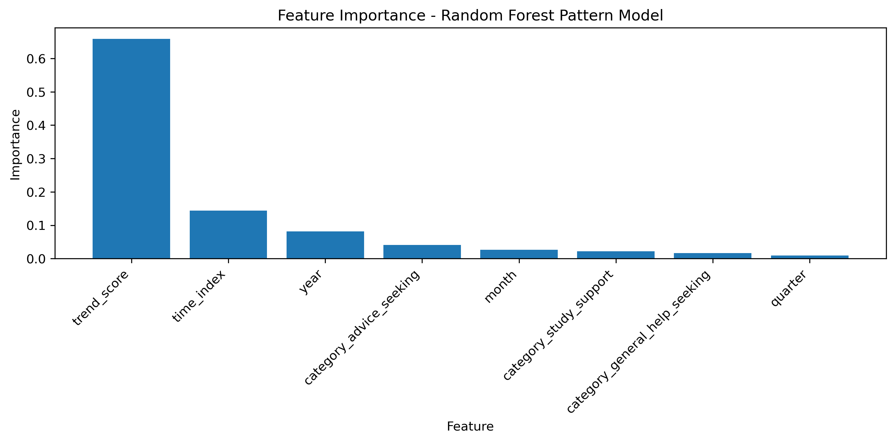

The most important feature in the Random Forest pattern-only model is `trend_score`. This means that the level of search interest itself is the strongest signal for distinguishing AI-related observations from traditional platform observations.

Time-related variables such as `time_index` and `year` also contribute to classification. This suggests that timing matters: AI-related search behavior becomes more distinguishable in later periods, while traditional platform trends follow different time patterns.

Category features are less important than trend score and time features, but they still provide context. This means the distinction between AI and non-AI observations is driven mostly by search interest level and temporal change, not only by the general category of the keyword.

---

## Model Validation

Validation was used to check whether the classification result was reliable.

### Cross-Validation

| Metric | Mean Score | Standard Deviation |
|---|---:|---:|
| F1-score | 0.7851 | 0.2672 |
| Accuracy | 0.8642 | 0.1708 |

The model performs better than the baseline on average. However, the standard deviation is relatively high, meaning performance changes depending on the split.

This suggests that AI-related search behavior changes across time periods.

---

### Time-Based Split

A time-based split was also tested.

This is stricter than a random split because the model trains on earlier observations and tests on later observations.

| Model | Accuracy | Precision | Recall | F1-score | ROC-AUC |
|---|---:|---:|---:|---:|---:|
| Random Forest - random split | 0.9315 | 0.9189 | 0.8831 | 0.9007 | 0.9920 |
| Random Forest - time-based split | 0.5845 | 0.3971 | 0.3506 | 0.3724 | 0.4153 |

The time-based model performs much worse than the random split model.

This shows that AI-related search behavior is dynamic. Older patterns do not perfectly predict newer periods.

---

## Regression Models

The regression task asks:

**Can a model predict the Google Trends search interest score?**

The models tested were:

- baseline regression
- Linear Regression
- Decision Tree Regression
- Random Forest Regression

---

### Regression Model Comparison

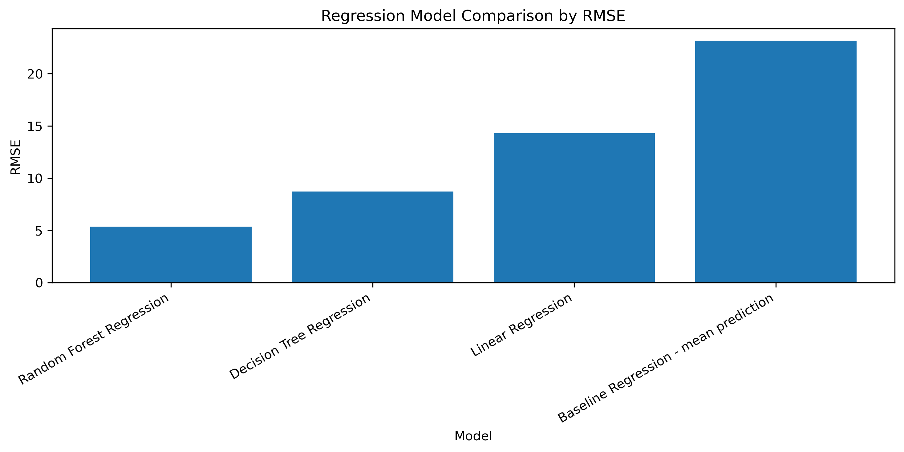

| Model | MAE | RMSE | R² |
|---|---:|---:|---:|
| Baseline Regression | 17.3444 | 23.1602 | -0.0160 |
| Linear Regression | 8.8317 | 14.2841 | 0.6135 |
| Decision Tree Regression | 4.5103 | 8.7294 | 0.8557 |
| Random Forest Regression | 2.6070 | 5.3726 | 0.9453 |

Random Forest Regression performs best.

This suggests that search interest is not random. It can be predicted from time, category, keyword, platform type, and AI/non-AI information.

---

### Actual vs Predicted Trend Scores

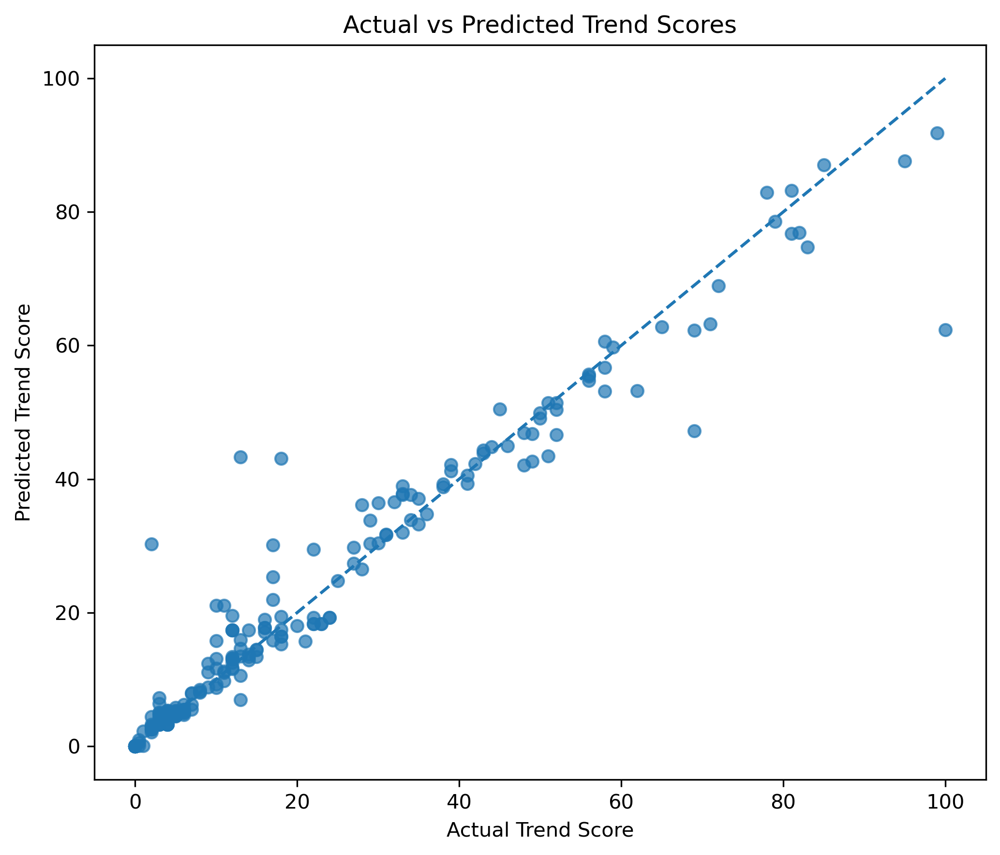

Most points are close to the diagonal line, meaning the Random Forest model predicts many trend scores well.

The model performs especially well for low and medium search interest values. Some high spikes are harder to predict, which is expected because sudden Google Trends peaks can be irregular.

---

## Overall Interpretation

The results tell a consistent story.

AI-related search behavior is becoming more visible, especially in advice-seeking and study-support contexts. Traditional platforms still exist in the data, but AI-related terms show distinct patterns.

The strongest evidence comes from Google Trends, hypothesis testing, and robustness checks. The paired t-tests showed statistically significant differences, and the Wilcoxon signed-rank tests supported these results even when the normality assumption was relaxed.

Traffic and survey datasets support the broader context. Machine learning adds another layer by showing that AI-related and non-AI observations can be distinguished and that search interest can be predicted.

The project does not prove complete replacement.  
It shows a measurable shift in online attention toward AI-based help-seeking tools.

---

## Limitations

This project has some limitations that should be considered when interpreting the results.

Google Trends does not provide individual-level user data, so the project cannot prove that the same users directly moved from traditional platforms to AI tools. It only shows search interest patterns over time.

The keyword set is also limited. The selected terms represent advice-seeking, general help-seeking, and study-support behavior, but they do not cover every possible form of online help-seeking.

Platform traffic data is used only as recent supporting context because it covers a short time period. Also, the survey datasets represent specific respondent groups, such as Stack Overflow users or Pew survey respondents.

Because of these limitations, the project does not claim complete replacement of traditional platforms. Instead, it shows evidence of a measurable shift in attention and search behavior toward AI-related tools.

---

## AI Assistance Disclosure

AI tools were used during this project for brainstorming, organizing the report structure, improving wording, and debugging code errors. They were also used to make explanations in the README and reports clearer.

All datasets, code execution, analysis decisions, visualizations, results, and final interpretations were reviewed and completed by the student.

---

## Final Conclusion

This project finds evidence that AI-based tools are becoming an important part of online help-seeking, advice-seeking, and study-support behavior.

The evidence supports three main conclusions:

| Conclusion | Meaning |
|---|---|
| AI-related search behavior is visible | People are increasingly searching for AI-related help terms |
| AI and traditional patterns differ | Their search trends are statistically and behaviorally different |
| The shift is not complete replacement | Traditional platforms still remain, but AI tools are now part of the help-seeking environment |

Overall, the findings suggest that the rise of AI tools is changing how people look for help online.

---

## How to Run

Install the required packages:

```bash
pip install -r requirements.txt
```

Open the notebooks in order:

```text
01_data_preparation.ipynb
02_eda_hypothesis_testing.ipynb
03_machine_learning_analysis.ipynb
```

Raw source files are stored in `data/raw/`, while the analysis mainly uses cleaned and processed files from `data/processed/`.
